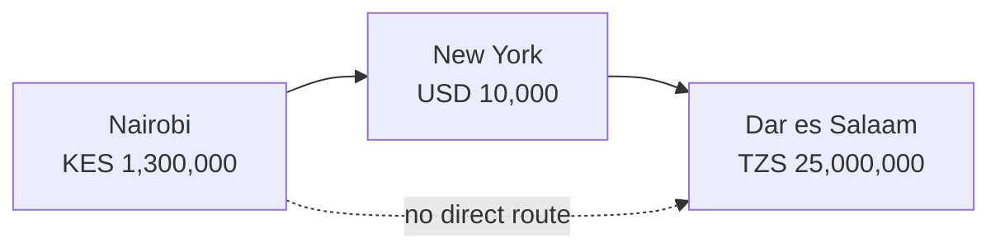
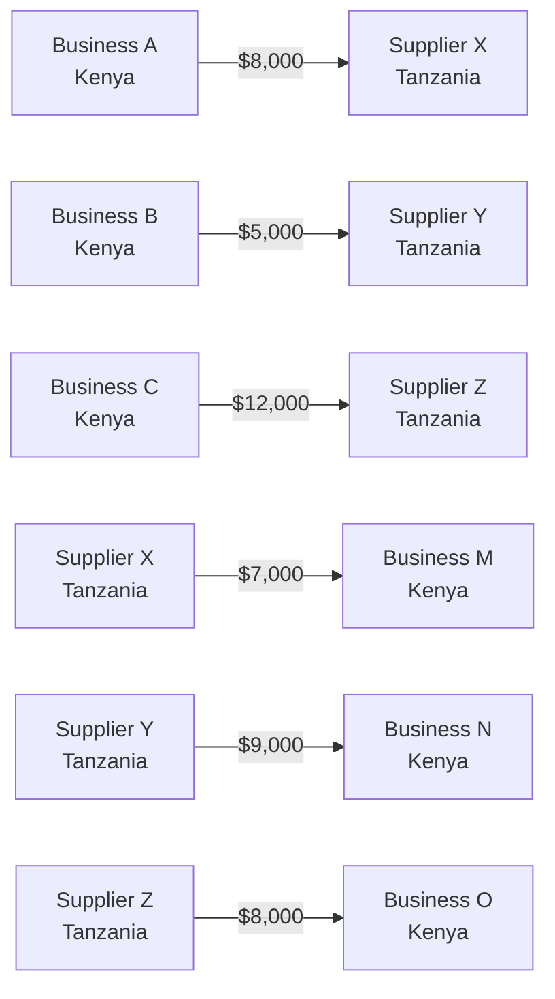
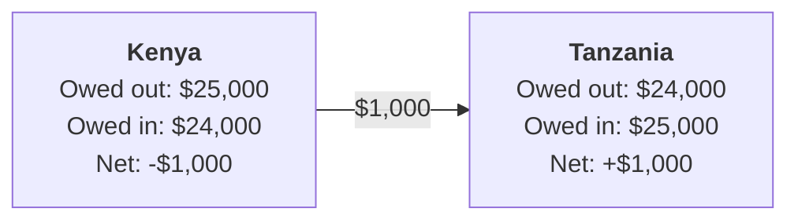

A Rift Research working paper on why faster messaging has not solved cross-border payment costs in Africa, and how corridor-level netting can reduce dollar liquidity requirements by 40 to 60 percent.

**Abstract.** Cross-border payments within Africa remain expensive and slow despite a decade of fintech innovation. This paper argues that the persistent friction is not a messaging problem but a liquidity problem: African cross-border settlement requires dollars, and dollars are structurally scarce on the continent. Recent stablecoin-based payment infrastructure has accelerated messaging but has not reduced the aggregate dollar liquidity required by the system. We describe an alternative architecture based on multilateral netting at the corridor level, drawing on principles used by clearing houses since the 18th century. Applied to the Kenya-Tanzania corridor, this framework compresses dollar liquidity requirements by an estimated 40 to 60 percent while addressing the specific timing and counterparty risks introduced by delayed settlement.

## The problem is not messaging

A payment of $1,000 sent from Nairobi to Dar es Salaam today loses between $50 and $100 in fees, exchange rate spreads, and delays. This friction has persisted for decades and has proven remarkably resistant to technological innovation. Understanding why requires distinguishing between two very different problems.

The first problem is *messaging*: how instructions to move money get transmitted between financial institutions. Traditional correspondent banking uses SWIFT, which is functional but slow. Stablecoin-based payment infrastructure uses blockchains, which are dramatically faster. Over the last five years, companies including Bridge (recently acquired by Stripe for $1.1 billion), BvnK, Conduit, and others have made significant progress on this messaging problem. Cross-border payment settlement times have compressed from days to minutes for participants using these rails.

The second problem is *liquidity*: the actual dollars, held on real balance sheets, that must exist somewhere in the system for value to move between parties. This problem has not been solved by faster messaging. If anything, it has been obscured.

Consider a payment from a Kenyan importer to a Tanzanian supplier. In the traditional banking system, the Kenyan bank converts shillings to dollars, sends those dollars through a correspondent bank in New York or London, and instructs the Tanzanian bank to release the equivalent in Tanzanian shillings. The payment technically routes Nairobi to New York to Dar es Salaam, even though the two African cities are 700 kilometres apart.

*Figure 1. Cross-border payment flow: Nairobi to Dar es Salaam via New York. Three to five days, $50 to $100 in fees on a $10,000 payment.*

This routing exists because there is no meaningful direct market between the Kenyan shilling and the Tanzanian shilling. Both currencies trade against the dollar but do not trade meaningfully against each other. The dollar functions as the intermediary currency that every counterparty in the global banking system trusts and accepts. The same pattern holds across most African corridor pairs: Nigerian naira to Ghanaian cedi, Kenyan shilling to Ugandan shilling, Rwandan franc to Tanzanian shilling. All route through the dollar.

### Why stablecoins have not solved this

Stablecoin-based payment infrastructure replaces the slow correspondent banking messaging with fast blockchain messaging. What it does not replace is the dollars themselves. Every stablecoin cross-border payment still requires dollars on both sides: the source-country payer needs dollars (or dollar-equivalents) to fund the stablecoin, and the destination-country recipient needs dollars to exit the stablecoin into local currency.

Under the hood, stablecoin payment companies solve this by maintaining large pools of USDC or USDT in accounts across multiple countries. When a payment is initiated, the company draws from a source-country pool and releases from a destination-country pool. The end user experiences the payment as instant, but the aggregate dollar liquidity requirement for the system has not decreased. It has been transferred from correspondent banks onto the balance sheets of stablecoin payment providers.

> The messaging got faster. The dollar dependency did not go away. It was transferred from correspondent bank balance sheets to stablecoin-provider balance sheets.

This explains the unit economics of stablecoin payment companies. They are being compensated to hold the dollar liquidity that the system requires. Their margins reflect the cost and risk of that liquidity provisioning. But the total dollars required for African cross-border payment flows have not been reduced. They have simply been redistributed.

This distinction matters because in African markets, aggregate dollar liquidity is a binding constraint. The continent runs chronic trade deficits with the rest of the world and has limited access to dollar reserves. Solutions that simply relocate the dollar requirement to a different balance sheet do not address the underlying scarcity. Solutions that reduce the aggregate requirement do.

## Netting as a compression technology

Netting is a mechanism for reducing the total value of payments that must be settled by matching offsetting obligations. Instead of settling each transaction individually, a netting system records multiple obligations on a shared ledger and settles only the net residual difference at defined intervals. The principle is simple but the compression effect is substantial when applied to balanced corridors.

### A worked example

Consider a stylised day of trade activity between three Kenyan businesses paying three Tanzanian suppliers, and three Tanzanian businesses paying three Kenyan suppliers.

**Flows from Kenya to Tanzania**

| Payer | Recipient | Amount |
| --- | --- | --- |
| Business A (Nairobi) | Supplier X (Dar es Salaam) | $8,000 |
| Business B (Nairobi) | Supplier Y (Arusha) | $5,000 |
| Business C (Nairobi) | Supplier Z (Mwanza) | $12,000 |
| **Total** | | **$25,000** |

**Flows from Tanzania to Kenya**

| Payer | Recipient | Amount |
| --- | --- | --- |
| Supplier X (Dar es Salaam) | Business M (Nairobi) | $7,000 |
| Supplier Y (Arusha) | Business N (Nairobi) | $9,000 |
| Supplier Z (Mwanza) | Business O (Nairobi) | $8,000 |
| **Total** | | **$24,000** |

In the current system, all six payments settle individually. Each requires currency conversion, correspondent banking transit, and independent settlement. The aggregate dollar volume that must move through the system to complete these six payments is $49,000. At a representative all-in cost of five percent, aggregate fees total approximately $2,450.

*Figure 2. Without netting: six independent payments totalling $49,000 in gross dollar flows.*

Under a netting architecture, the same six payments are recorded on a shared ledger. The ledger observes that Kenyan participants collectively owe Tanzanian participants $25,000, while Tanzanian participants collectively owe Kenyan participants $24,000. The net position is $1,000 flowing from Kenya to Tanzania. Only this $1,000 residual actually requires settlement in dollars. The remaining $48,000 of obligations cancel out through the netting mechanism.

*Figure 3. With netting: a $1,000 residual settlement replaces $49,000 of individual payment flows. Liquidity requirement compressed by 98 percent.*

All six recipients receive their full payment. All six payers pay their full obligation. But at the system level, dollar liquidity requirements have been compressed by 98 percent in this stylised example. In real corridors where flows are less perfectly balanced, compression rates typically fall in the 40 to 60 percent range. This remains a substantial reduction in the aggregate dollar liquidity the system must hold.

> The core insight: the dollar liquidity required by the payments system is not fixed. It is a function of how efficiently offsetting obligations are matched. Better matching reduces the aggregate requirement.

## Historical precedent

Netting is not a novel financial innovation. It is one of the oldest technologies in banking, with continuous application spanning more than two centuries. The London Bankers' Clearing House began netting inter-bank obligations in the 1770s. The New York Clearing House Association has done the same since 1853. Modern equivalents include CHIPS in the United States (which nets high-value dollar payments between banks), various central bank real-time gross settlement systems, and every major card network (Visa, Mastercard), which net inter-bank obligations daily rather than settling each cardholder transaction individually.

The reason netting has not been applied at scale to African cross-border payments is not technical. It is that three specific conditions had to converge before the model became viable in this context.

**First**, corridor volumes must be sufficient and roughly balanced for netting arithmetic to produce meaningful compression. A corridor where Kenya-to-Tanzania flows are $100 million and Tanzania-to-Kenya flows are $1 million would compress only $1 million out of $101 million in total flows. Meaningful compression requires corridors with substantial two-way trade. Kenya-Tanzania bilateral trade is approximately $900 million to $1.1 billion annually and roughly balanced in both directions, making it a suitable initial corridor.

**Second**, the settlement infrastructure must support programmable obligation recording and fast residual settlement. Traditional banking rails are too slow and too expensive to support continuous corridor-level netting economically. Blockchain-based settlement infrastructure, using USDC as the residual settlement asset, makes this economically viable at scale for the first time.

**Third**, regulatory frameworks must permit the entities operating netting networks to hold and settle obligations at the required scale. Kenya's Virtual Asset Service Providers Regulations, gazetted in July 2026, provide the first clear legal framework in East Africa for exactly this category of infrastructure. Comparable frameworks are emerging in Nigeria, Ghana, and South Africa.

These three conditions converged only in the last 18 to 24 months. This explains why corridor-level netting is only now being applied to African payments despite being a well-understood financial mechanism for over 200 years.

## Timing and counterparty risk

Netting introduces a specific risk that gross settlement systems do not have: the period between obligation submission and actual settlement. During this window, participants have received confirmation of payment but the underlying settlement has not yet occurred. Three distinct risks operate during this window and each requires specific mitigation.

### Counterparty default risk

If a participant defaults between obligation submission and settlement, the counterparty they were paying is exposed. If Kenyan Business A submits an $8,000 payment obligation at 10:00 AM and becomes insolvent before end-of-day settlement, the Tanzanian recipient has received confirmation of a payment that will not settle.

The standard mitigation is pre-funding. Participants must fund their obligations before those obligations are recorded on the netting ledger. The Tanzanian recipient sees the obligation only after the source-country funds have been secured in the network operator's operational account. A default by Business A at 11:00 AM does not affect the Tanzanian recipient because the funds are already held by the network operator.

### Operational risk

The netting network itself can experience outages, ledger integrity issues, or algorithmic errors during the settlement window. If the network fails to execute settlement as expected, participants on both sides are affected.

Standard mitigations include cryptographic integrity guarantees on the ledger (making tampering detectable), deterministic and testable netting algorithms, third-party security audits, formal certification against international standards (ISO 27001, SOC 2), and clearly defined operational SLAs with defined recourse procedures. These are engineering and process disciplines rather than novel financial innovations.

### Currency risk

Exchange rates between the source and destination currencies can move between obligation submission and residual settlement. Someone in the system must bear the cost or benefit of these movements.

The standard mitigation is fixing the exchange rate at the moment of obligation submission. Both counterparties transact at the rate available at the time the payment is initiated. Rate movements after that point are absorbed by the network operator, whose exposure is limited to the small residual amount that actually requires dollar settlement, and whose settlement window is designed to be short (typically end-of-day) to minimise exposure.

> Timing risk in a netting system is real but structurally different from timing risk in traditional cross-border payment. The window is shorter (hours rather than days), the failure modes are clearer, and the mitigations are concrete engineering problems rather than fundamental limitations.

## Positioning relative to PAPSS

The Pan-African Payment and Settlement System, launched by Afreximbank and the African Union in 2022, is the most prominent existing effort to reduce dollar dependence in African cross-border payments. PAPSS operates at the central bank level, netting payments between participating central banks on a daily basis and settling residuals through Afreximbank as the central settlement agent.

PAPSS and corridor-level netting infrastructure (of the kind described in this paper) are complementary rather than competing. They operate at different layers of the payment stack and serve different market segments.

PAPSS depends on central bank participation, which is negotiated country by country and expands at the pace of central bank coordination. As of 2026, participating central banks include Ghana, Nigeria, Kenya, Egypt, Zambia, and several others, with progressive expansion continuing. PAPSS residual settlement occurs in hard currency through Afreximbank, which functions as a hub with associated concentration and liquidity requirements.

Corridor-level netting networks operating at the business-to-business layer can scale independently of central bank participation and can settle residuals in stablecoin assets rather than hard currency. This allows faster corridor expansion and more programmable settlement, at the cost of operating outside the central bank framework.

The long-term architecture is likely to include both layers. Central-bank-level netting for large inter-bank flows and formal financial system integration, and business-level netting for commercial cross-border trade at the corridor level. Rift operates in the latter category.

## Market context

Africa's chronic underdevelopment of intra-regional trade is well documented. Intra-African trade represents approximately 15 percent of the continent's total trade, compared to over 60 percent for intra-European trade and approximately 50 percent for intra-Asian trade. This gap is not primarily explained by lack of political will (the African Continental Free Trade Area exists specifically to address it) or lack of complementary economic bases. It is substantially explained by the cost and complexity of moving money between African countries.

Cross-border payment friction functions as a hidden tax on intra-African trade. A Kenyan business considering whether to source inputs from Tanzania or from China faces different transaction costs on payment for each option. The dollar-detour structure of intra-African payments means the Tanzanian option carries payment costs that the China option often does not, despite the shorter physical distance and existing trade agreements. This structural bias tilts sourcing decisions away from intra-African trade.

Reducing cross-border payment friction is therefore not only a fintech opportunity but a piece of the broader continental development agenda. Infrastructure that meaningfully compresses the cost of moving money between African countries would contribute to the conditions under which intra-African trade could grow toward the levels observed in Europe and Asia.

## Conclusion

Cross-border payment costs in Africa have proven resistant to a decade of fintech innovation because the innovation has focused on the wrong constraint. Faster messaging via stablecoin infrastructure has produced meaningful improvements in payment speed but has not addressed the underlying scarcity of dollar liquidity that determines the aggregate cost of the system.

Multilateral netting at the corridor and business level offers a structurally different approach. By matching offsetting obligations and settling only residuals, netting compresses the dollar liquidity required by the system rather than redistributing it. The mechanism is well-established in financial history, having been applied continuously in clearing house contexts for over two centuries. What is new is the combination of programmable settlement infrastructure, sufficient corridor volume, and regulatory clarity that makes the model economically viable for African corridors.

The practical constraints on this approach are non-trivial. Netting requires corridor volume balance, participant pre-funding, engineering discipline in operating the underlying infrastructure, and regulatory operating environments that permit the required scale. Meeting these conditions is engineering and operational work rather than fundamental financial innovation. The question for the next several years is whether operators can build the required infrastructure and demonstrate the compression effects at scale.

Rift is one operator pursuing this approach, initially in the Kenya-Tanzania corridor, with expansion planned into adjacent corridors as the netting graph grows. Other operators are likely to enter this category as the underlying conditions continue to mature. The relevant question for the industry is not whether netting-based settlement will play a role in African cross-border payments infrastructure. The question is which operators will build it, how quickly, and with what quality of execution.

---

**About Rift Research.** Rift Research is the publications arm of Rift, a settlement infrastructure company for African cross-border payments based in Nairobi. Working papers reflect the analytical work underlying Rift's product development and are published to contribute to the broader industry conversation. Correspondence to [research@riftfi.com](mailto:research@riftfi.com). For company information, [riftfi.com](https://riftfi.com).
