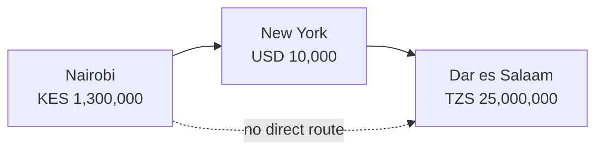
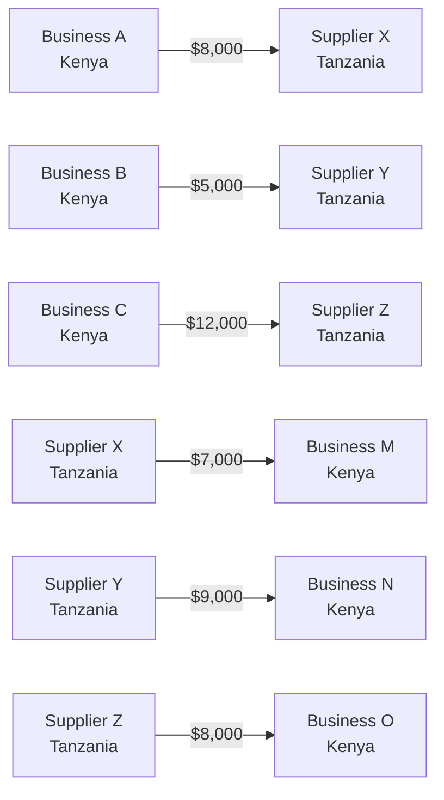
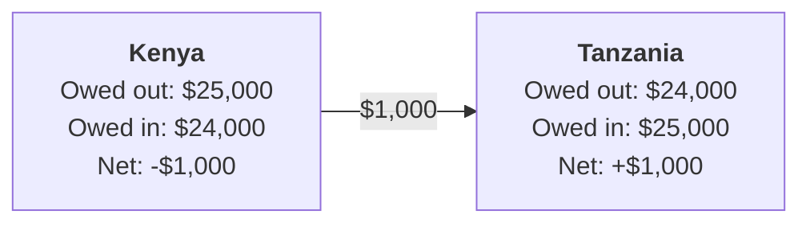

Send $1,000 from Nairobi to Dar es Salaam today and somewhere between $50 and $100 of it disappears into fees, spread and delay. That has been true for decades, through every wave of fintech that promised to fix it. It is worth being precise about why.

## The problem is not messaging

There are two problems hiding inside every cross-border payment, and they get confused constantly.

The first is messaging: how the instruction to move money travels between banks. Correspondent banking does this over SWIFT, which works but is slow. Stablecoin rails do it over blockchains, which are fast. This is the problem the last five years actually solved. Bridge, bought by Stripe for $1.1 billion, along with BvnK, Conduit and others, compressed settlement times from days to minutes for anyone on their rails. That is real progress and worth saying plainly.

The second is liquidity: the actual dollars, sitting on somebody's real balance sheet, that have to exist somewhere for value to move at all. Nobody solved this one. Speed just made it easier to stop looking at it.

Watch what happens when a Kenyan importer pays a Tanzanian supplier. The Kenyan bank sells shillings for dollars, ships those dollars through a correspondent bank in New York or London, then tells the Tanzanian bank to release shillings on the other side. Nairobi to New York to Dar es Salaam, for two cities 700 kilometres apart.

*The route the money actually takes. Three to five days, $50 to $100 on a $10,000 payment.*

The detour exists because there is no real market between the Kenyan shilling and the Tanzanian shilling. Both trade against the dollar. Neither trades meaningfully against the other. So the dollar becomes the bridge by default, because it is the one currency every counterparty in the chain will accept. Naira to cedi, Kenyan shilling to Ugandan shilling, Rwandan franc to Tanzanian shilling: same story, same detour.

### Mobile money got furthest, and still hit it

The most impressive answer to the messaging problem did not come from crypto, and it did not come from correspondent banking. It came from mobile money. M-PESA, Airtel Money and their peers reach hundreds of millions of people across the continent, move value between them in seconds, and already run across some cross-border corridors through operator partnerships. That is a genuine achievement, built here, and it set the expectation that sending money should feel instant.

What it does not do is remove the settlement problem. It moves it upstream. Every cross-border mobile money transaction still needs the operators to hold pre funded pools of liquidity in both countries, and rebalancing those pools eventually runs into the same missing piece as everything else: an FX market between African currencies that does not meaningfully exist. Mobile money took the friction off the user and put it on the operator's balance sheet. The dollars the system has to hold did not fall.

That is not a criticism. It is where the problem actually lives, one layer below the part mobile money fixed.

### Stablecoins moved the problem, they did not remove it

Stablecoin infrastructure swaps slow correspondent messaging for fast blockchain messaging. What it does not swap out is the dollars. Every stablecoin payment across a border still needs dollars on both ends: the payer needs them to fund the coin, the recipient needs them to get out of the coin and into local currency.

The way this works underneath is that stablecoin companies keep large pools of USDC or USDT sitting in accounts in every country they serve. A payment draws from the pool on one side and releases from the pool on the other. To the user it feels instant. But the total dollars the system needs did not fall by a cent. They moved off correspondent bank balance sheets and onto stablecoin company balance sheets.

> The messaging got faster. The dollar dependency did not go away. It moved from correspondent bank balance sheets to stablecoin provider balance sheets.

This is also the honest explanation of how those companies make money. They are being paid to hold dollar liquidity the system requires, and their margin is the cost and risk of holding it. Useful work. But the dollars required by African cross-border flows have not been reduced, only redistributed.

That distinction matters more here than almost anywhere else, because in African markets dollar liquidity is the binding constraint. The continent runs persistent trade deficits with the rest of the world and has limited access to reserves. Moving the dollar requirement to a different balance sheet does nothing about the scarcity. Reducing the requirement does.

## Netting is a compression technology

Netting cuts the total value that has to settle by cancelling obligations that point in opposite directions. Rather than settling every transaction on its own, you record them all on a shared ledger and settle only the difference, at whatever interval you choose. Simple idea. The compression is large whenever a corridor has real two way trade.

### A worked example

Take a day of trade between three Kenyan businesses paying three Tanzanian suppliers, and three Tanzanian businesses paying three Kenyan suppliers.

**Kenya to Tanzania**

| Payer | Recipient | Amount |
| --- | --- | --- |
| Business A (Nairobi) | Supplier X (Dar es Salaam) | $8,000 |
| Business B (Nairobi) | Supplier Y (Arusha) | $5,000 |
| Business C (Nairobi) | Supplier Z (Mwanza) | $12,000 |
| **Total** | | **$25,000** |

**Tanzania to Kenya**

| Payer | Recipient | Amount |
| --- | --- | --- |
| Supplier X (Dar es Salaam) | Business M (Nairobi) | $7,000 |
| Supplier Y (Arusha) | Business N (Nairobi) | $9,000 |
| Supplier Z (Mwanza) | Business O (Nairobi) | $8,000 |
| **Total** | | **$24,000** |

Today all six settle separately. Each one converts currency, crosses correspondent banking, and settles on its own. To complete six payments, $49,000 has to move through the system. At a fairly typical all in cost of five percent, that is about $2,450 in fees.

*Six payments, six settlements, $49,000 of gross dollar flow.*

Now record the same six on a shared ledger. Kenyan participants owe Tanzanian participants $25,000. Tanzanian participants owe Kenyan participants $24,000. The net is $1,000 going from Kenya to Tanzania, and that $1,000 is the only thing that needs to settle in dollars. The other $48,000 cancels.

*The same six payments, netted. One settlement of $1,000 replaces $49,000 of flow.*

Every recipient is paid in full. Every payer pays in full. Nobody gets less. But the dollars the system had to hold fell by 98 percent.

That number is flattering because the example is tidy. Real corridors are never that balanced, and real compression lands somewhere between 40 and 60 percent. Cutting the dollars a corridor needs by half is still an enormous change in what it costs to run.

> The dollar liquidity a payments system needs is not a fixed quantity. It is a function of how well you match obligations that cancel. Match them better and you need fewer dollars.

## None of this is new

Netting is one of the oldest tricks in banking. The London Bankers' Clearing House was netting between banks in the 1770s. The New York Clearing House Association has done it since 1853. CHIPS nets high value dollar payments between American banks today. Every central bank settlement system uses it. Visa and Mastercard net between banks daily rather than settling your card transactions one by one, which is the only reason card economics work at all.

So the interesting question is not whether netting works. It is why nobody has run it across African corridors at scale. The answer is not technical. Three things had to line up first.

**Volume and balance.** Netting only compresses if flows run both ways. A corridor with $100 million going out and $1 million coming back nets away $1 million out of $101 million, which is nothing. You need real two way trade. Kenya and Tanzania do roughly $900 million to $1.1 billion a year and it runs fairly evenly in both directions, which is why it is the right corridor to start in.

**Infrastructure.** Somebody has to record obligations programmatically and settle the residual quickly. Traditional rails are too slow and too expensive to net a corridor continuously and still make the economics work. Blockchain settlement with USDC as the residual asset is the first thing that makes it cheap enough.

**Regulation.** Whoever operates the network has to be allowed to hold and settle obligations at scale. Kenya's Virtual Asset Service Providers Regulations, gazetted in July 2026, are the first clear legal framework in East Africa for exactly this kind of infrastructure. Nigeria, Ghana and South Africa are moving the same way.

All three converged in the last 18 to 24 months. That is the whole reason a 250 year old mechanism is only now showing up in African payments.

## What netting actually costs you

Netting buys compression by delaying settlement, and that delay is a real cost. Between the moment an obligation is submitted and the moment it settles, someone is exposed. Three different things can go wrong in that window, and each has a specific answer.

### The payer defaults

If a participant goes under before settlement, whoever they were paying is holding nothing. Business A submits an $8,000 obligation at 10:00 and is insolvent by noon. The Tanzanian supplier has a confirmation for a payment that will never arrive.

The answer is pre funding. You fund the obligation before it is recorded, not after. The recipient never sees it until the money is already secured with the network operator. Business A can fail at 11:00 and it changes nothing on the Tanzanian side, because those funds stopped being Business A's an hour earlier.

### The network breaks

The netting system itself can go down, corrupt its ledger, or net wrongly. If settlement does not execute, everyone in the window is affected.

The answers here are boring engineering. Cryptographic integrity on the ledger so tampering is detectable. Netting logic that is deterministic and testable. Outside security audits. ISO 27001 and SOC 2. Operational SLAs with actual recourse when they are missed. None of it is clever finance, and that is the point.

### The rate moves

Currencies move between submission and settlement, and somebody has to absorb it.

Fix the rate when the payment is initiated. Both sides transact at the rate they saw. Anything that moves afterwards lands on the network operator, whose exposure is only the small residual that actually settles in dollars, over a window kept deliberately short.

> The timing risk is real, but it is a different shape from the timing risk you already accept in correspondent banking. The window is hours instead of days, the failure modes are enumerable, and the fixes are engineering problems rather than facts of life.

## Where this sits next to PAPSS

The Pan-African Payment and Settlement System, launched by Afreximbank and the African Union in 2022, is the most serious existing attempt to get the dollar out of African payments. It nets between participating central banks daily and settles the residual through Afreximbank.

PAPSS and corridor level netting are not competitors. They sit at different layers and serve different people.

PAPSS runs on central bank participation, which is negotiated country by country and grows at the speed of central bank coordination. As of 2026 that includes Ghana, Nigeria, Kenya, Egypt, Zambia and others, still expanding. Its residual settles in hard currency through Afreximbank, which makes Afreximbank a hub, with the concentration and liquidity requirements that implies.

A corridor level network operating between businesses can add corridors without waiting for anyone's central bank, and can settle its residual in stablecoins instead of hard currency. That buys speed and programmability. What it gives up is standing inside the central bank framework.

The end state almost certainly has both. Central bank netting for large interbank flows and formal integration, business level netting for commercial trade at the corridor level. Rift is building the second one.

## Why any of this matters

Intra-African trade is about 15 percent of the continent's total trade. Intra-European is over 60 percent. Intra-Asian is around 50 percent. That gap is not really about political will, since the African Continental Free Trade Area exists precisely to close it, and it is not about economies that have nothing to sell each other. A large part of it is simply how hard and expensive it is to move money between African countries.

Payment friction works as a quiet tax on trade between neighbours. A Kenyan business deciding whether to buy inputs from Tanzania or from China pays different costs to settle each one, and the Tanzanian option is often the more expensive one to pay for, despite being closer and covered by trade agreements. That bias is structural, and it pushes sourcing away from the continent.

So compressing the cost of moving money between African countries is not only a fintech opportunity. It removes one of the specific reasons intra-African trade stays small.

## The point

Cross-border payments in Africa resisted a decade of fintech because the fintech was aimed at the wrong constraint. Faster messaging genuinely made payments quicker. It did nothing about the scarce dollars that set what the system costs.

Netting is a different move. Match the obligations that cancel, settle only what is left, and the dollars the system needs actually fall rather than moving to someone else's balance sheet. The mechanism has been running in clearing houses for over two centuries. What is new is that programmable settlement, corridor volume and regulatory clarity finally showed up in the same place at the same time.

The constraints are real. You need balanced corridors, participants who pre fund, disciplined engineering, and somewhere legal to operate. All of that is work, not invention. Which means the open question is not whether netting belongs in African payments infrastructure. It is who builds it, how fast, and how well.

We are building it, starting with Kenya and Tanzania, and adding corridors as the graph fills in. If you move money across these borders and want to talk about it, I am at [amschel@riftfi.com](mailto:amschel@riftfi.com).
