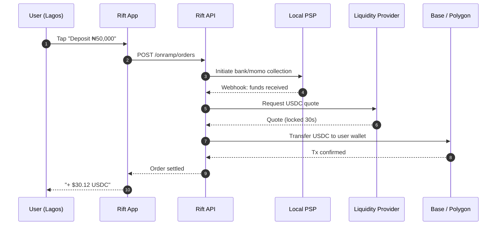
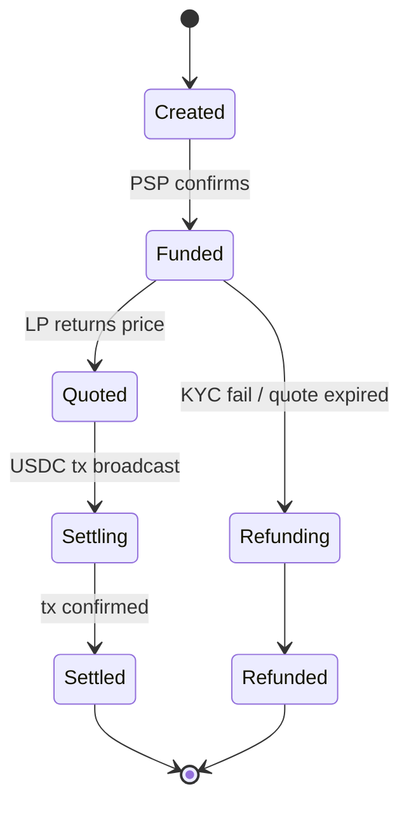

When you tap **Deposit** in the Rift app, something deceptively simple happens:
you put in Naira, and a few seconds later your balance shows USDC.

Under the hood there are seven moving parts, three regulated entities, and a
lot of careful queueing. This post is a tour of the path your money takes.

## The high-level flow



Seven hops. Median latency: about twelve seconds. The thing that makes this
fast is **pre-positioned liquidity**: we don't go shop the market when you tap.
We've already moved USDC into our hot wallet for the corridor you're using,
and we settle to you from there.

## Where the magic isn't

People assume the slow part is the chain. It isn't. The slow parts are:

- Bank webhook latency (PSP → Rift)
- KYC re-checks for new corridors
- The first time you ever use a destination address

Everything else is fast.

## What we manage as the operator

Here's the state machine an order moves through.



If anything stalls, an internal alarm goes off and we route around the failure
— a different PSP, a different LP, a different chain. The user sees one number
go up. We see the dance.

## What this means for builders

If you're building on Rift Infra (our API), you get the **settled** event
either via polling `GET /onramp/orders/:id` or via signed webhook. Both arrive
at the same time. Pick whichever fits your stack.

```ts
const order = await rift.onramp.create({
  user: "usr_4f9a",
  amount: 50_000,
  currency: "NGN",
  destination: "USDC@base",
});

// option A — poll
let s = order.status;
while (s !== "settled") {
  await sleep(2_000);
  s = (await rift.onramp.get(order.id)).status;
}
```

That's it. We hide the seven hops.

## Closing

The dream is for the user to never know any of this exists. They tap, the
number changes. Behind the scenes, three regulated entities and a queue of
liquidity providers coordinate to make it feel boring. That's the goal:
**boring money, exciting access**.
