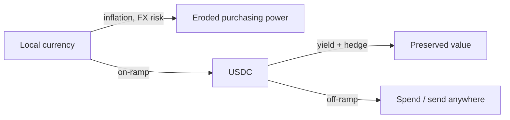

Most stablecoin coverage you read is written from a place where the local
currency is fine. So the framing is always trader-y: yield, arb, leverage.

But the people who care most about a stable dollar are not traders. They are
small business owners in Accra paying suppliers in Shenzhen, freelancers in
Lagos who are tired of being scammed on P2P, and parents in Nairobi who watched
their savings lose 14% to inflation last year.

For them, a stablecoin isn't a trade — **it's a savings account that finally
works.**

## A simple mental model

The trick is not that USDC goes up — it doesn't, that's the point. The trick
is that it doesn't go *down* in real terms the way the local currency does.

Multiply that across a continent and you start to see the size of the prize.

## Who actually adopts first

Adoption follows pain. Pain is highest where:

| Region | FX volatility | Banking access | Stablecoin demand |
| --- | --- | --- | --- |
| Western Europe | Low | Universal | Mostly traders |
| North America | Low | Universal | Mostly traders |
| Sub-Saharan Africa | High | Patchy | Savings + payments |
| LATAM | High | Improving | Savings + remittance |
| Southeast Asia | Moderate | Mobile-first | Payments + remittance |

The interesting markets — Nigeria, Kenya, Argentina, Vietnam, Philippines — are
where the *use case* for stablecoins is most obvious, not where you'd expect
the cleanest regulatory frame.

## What this means for builders

If you want to build on stablecoin rails, **build for the markets that need
them most**. Not the ones with the smoothest paperwork. Demand isn't theoretical
in Lagos — it's measured in queues at P2P meetups every Saturday morning.

That's what Rift is for: making the rails so boring that anyone with an
internet connection can use them, no matter where they live.

> "The future is already here, it's just not evenly distributed." — usually
> said about Silicon Valley. Increasingly, it's true about Lagos.

If you're building something here, [reach out](mailto:admin@riftfi.xyz). We
love early-stage teams.
